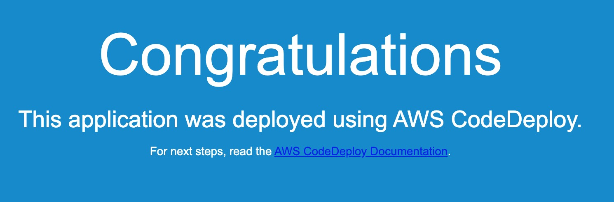

This is the tutorial that you can find on the AWS [official documentation](https://docs.aws.amazon.com/codedeploy/latest/userguide/tutorials-github.html).

## Notes 
* `$ AWS CodeDeploy does not have the permissions required to assume the role`  
   According to the compute platform that you’re going to deploy, a related service role needs to be established.
* How to check the issue of not being able to ssh an EC2 instance  
  1. the permissions of your private key file  
  2. the settings of the security group(s) attached to the EC2  
  3. the settings of network ACLs in a VPC where the EC2 resides  

## Success Screenshot  
  

## Launch Instance
```sh
aws ec2 run-instances \
  --image-id ${AMI ID} \
  --key-name ${key-pair name} \
  --user-data file://instance-setup.sh \
  --count 1 \
  --instance-type t2.micro \
  --iam-instance-profile Name={instance profile name} \
  --tag-specifications 'ResourceType=instance,Tags=[{Key=Name,Value=CodeDeployDemo}]'
```
